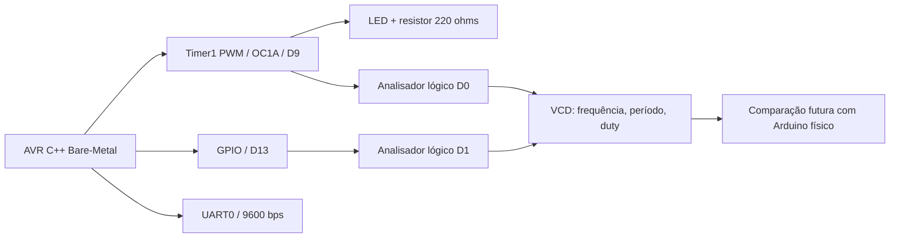

# SHINOBI AVR Bare-Metal PWM Lab

**From Physics to Firmware | ATmega328P · Timer1 · GPIO · UART · VCD Analysis**

[](LICENSE)
[](sketch.ino)
[](evidence/VCD_VALIDATION.md)

**Um projeto independente de engenharia embarcada.** Firmware AVR no nível dos registradores, circuito simulado, captura lógica original, medidas quantitativas e testes automatizados. O [portfólio SHINOBI Engineering](https://anderson-shinobi.github.io/#interactive-lab) funciona como vitrine; o laboratório pode ser estudado, executado e testado diretamente aqui, sem abrir o site.

> **Simulação validada, hardware físico pendente.** Os resultados deste repositório vêm de timestamps digitais do Wokwi; ainda não são medições elétricas feitas na bancada.

## Abrir a simulação

**[▶ Executar projeto no Wokwi](https://wokwi.com/projects/477357756254868481)** · [Código-fonte](sketch.ino) · [Circuito](diagram.json) · [Relatório VCD](evidence/VCD_VALIDATION.md) · [Arquivo VCD original](evidence/wokwi-logic.vcd)

*As capturas do experimento foram fornecidas pelo autor e documentadas na sessão anterior. O projeto público no Wokwi pode ter alterações visuais em relação ao `diagram.json` arquivado aqui; o firmware e o diagrama do site original foram copiados sem mudanças de conteúdo.*

## Visão geral



- **MCU:** ATmega328P / Arduino Uno R3, `F_CPU=16 MHz`.
- **PWM:** Timer1 Fast PWM 8-bit (modo 5), prescaler 64, saída PB1/OC1A (D9).
- **GPIO:** PB5 (D13) alterna a cada fase.
- **UART:** registradores USART0, 9600 bps.
- **Sem Arduino HAL:** não utiliza `pinMode`, `digitalWrite`, `analogWrite`, `Serial` ou `delay`.
- **Observação:** `_delay_ms()` da AVR-libc é utilizado e o wrapper do Arduino chama `setup()`/`loop()` no Wokwi.

### Resultados medidos em simulação

| Medida | Resultado VCD |
|---|---:|
| Períodos completos analisados | **4.586** |
| Frequência PWM | **976,5625 Hz** |
| Período PWM | **1,024 ms** |
| `OCR1A = 26` | **10,15625%** |
| `OCR1A = 128` | **50,00000%** |
| `OCR1A = 230` | **89,84375%** |
| Intervalo mediano entre transições D13 | **~1,03193 s** |

Os textos `10%`, `50%` e `90%` na UART são **rótulos de referência**, não medições. Os valores acima foram extraídos do [VCD](evidence/wokwi-logic.vcd). Consulte o [relatório técnico](evidence/VCD_VALIDATION.md) para metodologia e limitações.

## Executar os testes

**Pré-requisitos locais:** Python 3 e, para compilar o firmware, `gcc-avr` + `avr-libc`.

```bash
# Validar os hashes do código original, conexões e medições digitais
python3 -m unittest discover -s tests -v

# Recalcular a captura diretamente a partir das transições do VCD
python3 scripts/analyze_vcd.py evidence/wokwi-logic.vcd

# Compilar no nível de registradores (no Linux com AVR-GCC)
sudo apt-get install -y gcc-avr avr-libc
avr-g++ -std=gnu++11 -Os -Wall -Wextra -Werror -mmcu=atmega328p \
  -DF_CPU=16000000UL -x c++ -c sketch.ino -o /tmp/shinobi-pwm.o
```

A [pipeline GitHub Actions](.github/workflows/ci.yml) executa os testes e a compilação quando este código for publicado em um repositório GitHub próprio.

## Estrutura

```text
├── sketch.ino                         Firmware original, preservado
├── diagram.json                       Diagrama original, preservado
├── LICENSE                            MIT · Anderson Nogueira · 2026
├── tests/test_lab.py                  Testes de integridade, circuito e VCD
├── scripts/analyze_vcd.py             Analisador quantitativo de VCD
├── evidence/
│   ├── wokwi-logic.vcd                Captura original do Wokwi
│   ├── VCD_VALIDATION.md              Relatório de engenharia
│   └── measurements.csv               Dados tabulados
└── .github/workflows/ci.yml           CI independente
```

## Próxima etapa: hardware e Renode

1. **Arduino Uno R3 físico:** usar o mesmo firmware e conferir clock, voltagem, corrente, frequência, duty cycle e temporização em instrumento externo.
2. **Matriz de comparação:** colocar lado a lado os resultados do Wokwi e da placa física, com incertezas e tolerâncias explícitas.
3. **Renode:** investigar o suporte adequado ao MCU/periféricos ou utilizar uma plataforma suportada para experimentos adicionais de emulação; não presumir compatibilidade direta com a simulação Wokwi.

## Licença e autoria

**MIT License — © 2026 Anderson Nogueira.** Consulte [LICENSE](LICENSE). A licença abrange os arquivos originais do laboratório e não concede direitos sobre nomes, logotipos e recursos de terceiros, incluindo Wokwi e Arduino.

**Projeto relacionado:** [SHINOBI Engineering — From Physics to Firmware](https://anderson-shinobi.github.io/).